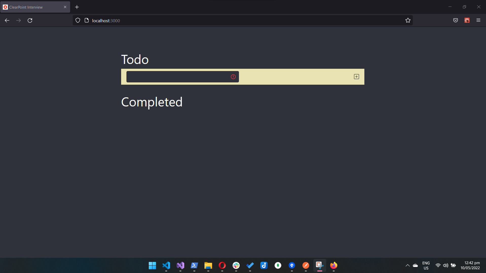

# Developer Assessment

This repository contains code used in the interview process for developers joining the Microsoft Engineering Practice at ClearPoint.

There are two parts to this solution and depending on the type of role you are applying for you will be asked to contribute to one or both areas.
The application is a simple to-do list that allows a user to create items in a list and mark them as complete.
It is a React-based front end application that uses a Microsoft Web API at the backend to facilitate using and persisting items in this to-do list.
  

## FOR THOSE APPLYING FOR A BACK-END DEVELOPER ROLE

For this exercise you are asked to refactor the back end code in this solution. This code is in the **Backend** folder.
You are free to make changes as and where you see fit. Think about how you might structure the solution, add appropriate tests using a framework of your choice, and leave the solution in a more maintainable and more easily understood state than it was originally.
  

## FOR THOSE APPLYING FOR A FULL-STACK DEVELOPER ROLE

For this exercise you are asked to complete the requirements for the *back end developer role above as well as* enhance the UI functionality in the **Frontend** folder.
The front end functionality requires the following to be added:

1. The ability to surface any errors from the backend API in the UI
2. The ability to mark an item in the to-do list as complete
3. Add unit tests to cover the new functionality using a framework of your choice

 
For both role types, remember that *maintainability and clarity* is key in your solution. 
You are welcome to use comments in the code to outline any assumptions you might make and/or outline your thinking at various points.
Once completed you can either push the completed solution to your own repo and send us the link or put the completed zip file/solution on some shared folder that we can get to.
  
We look forward to seeing your submission and have fun!

## Solution Notes

This solution uses simple API KEY authentication. In order to make sure this solution works correctly on your local environment, you must carry out the following steps:
- Add the following environment variables to the `.env` file in the `FrontEnd` root folder:
    - REACT_APP_API_KEY="{your_api_key}"
    - REACT_APP_API_URL="{your_local_api_url}"
- Add the following variables to the `appSettings.json` | `appSettings.Development.json`
    - "API_KEY": "{your_api_key}"

When running the solution locally, you must make sure that both the backend and frontend components are running. You can do this in any way you wish, but for debugging purposes you can carry out the following:
- Open `developer-assessment\Backend\TodoList.Api\TodoList.Api` in Visual Studio and run the `IIS Express` debug configuration
- Open a terminal session at `developer-assessment\Frontend` and run the `npm start` command

When testing the application locally you can so by running the following commands respectfully:
- Open `developer-assessment\Backend\TodoList.Api\TodoList.Api` in Visual Studio and run all tests in the Test Explorer
- Open a terminal session at `developer-assessment\Frontend` and run the `npm test` command

## Screenshots

